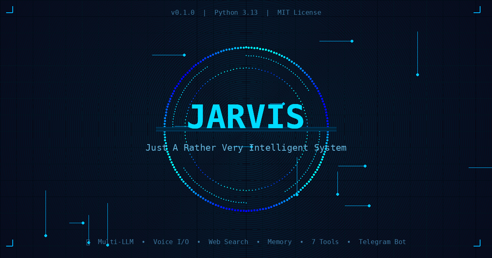

<div align="center">



### Just A Rather Very Intelligent System


**A modular, agent-first personal AI assistant.**
Voice, memory, multi-LLM, tools — all from Telegram.

[Quick Start](#-quick-start) • [Features](#-features) • [Architecture](#-architecture) • [Commands](#-commands) • [Tools](#-tools) • [Roadmap](#-roadmap)

</div>

---

## ✨ Features

<div align="center">

| | Feature | Description |
|---|---------|-------------|
| 🧠 | **Multi-LLM** | Chat with MiMo, GPT-4o, Claude — switch on the fly |
| 🗣️ | **Voice I/O** | Speak to JARVIS (Whisper STT), hear replies (edge-tts) |
| 🌐 | **Web Search** | Search the web, summarize URLs, read RSS |
| 📥 | **Media DL** | Download YouTube, TikTok, Instagram, Twitter |
| 💾 | **Memory** | Remembers conversations (STM) + facts (LTM) |
| 🔧 | **7 Tools** | Search, Calculator, Shell, File, Browser, API, Python |
| 🔒 | **Security** | Auth, rate limiting, input sanitization |
| 📊 | **Monitoring** | System status, CPU/RAM/Disk alerts |

</div>

---

## 🏗️ Architecture

```
                         ┌─────────────────────┐
                         │   📱 Telegram Bot    │
                         │  (python-tg-bot v22) │
                         └─────────┬───────────┘
                                   │
                         ┌─────────▼───────────┐
                         │   🎯 Orchestrator    │
                         │  (Session Manager)   │
                         └─────────┬───────────┘
                                   │
                    ┌──────────────┼──────────────┐
                    │              │              │
           ┌────────▼──────┐ ┌────▼─────┐ ┌──────▼──────┐
           │  🧠 Planner   │ │ 🔧 Tools │ │  💾 Memory  │
           │  (LLM Decompose)│ │ (7 Built) │ │  (STM+LTM)  │
           └────────┬──────┘ └────┬─────┘ └──────┬──────┘
                    │              │              │
           ┌────────▼──────┐ ┌────▼─────┐ ┌──────▼──────┐
           │  🚀 Executor  │ │ 🌐 Web   │ │  🗣️ Voice   │
           │  (Step Runner) │ │ (Search)  │ │ (STT + TTS)  │
           └───────────────┘ └──────────┘ └─────────────┘
```

---

## 🚀 Quick Start

### Prerequisites

- **Python 3.11+**
- **Telegram Bot Token** — Get one from [@BotFather](https://t.me/BotFather)
- **LLM API Key** — MiMo (free) recommended, or OpenAI/Anthropic

### Installation

```bash
# 1. Clone the repo
git clone https://github.com/irfan420x/JARVIS.git
cd JARVIS

# 2. Install dependencies
pip install -r requirements.txt

# 3. Configure environment
cp .env.example .env
# Edit .env with your tokens (see Configuration below)

# 4. Launch JARVIS
python -m src.main
```

### Configuration

Edit `.env` with your credentials:

```env
# Telegram Bot (required)
TELEGRAM_BOT_TOKEN=your_bot_token_here
TELEGRAM_OWNER_ID=your_telegram_user_id
TELEGRAM_ALLOWED_USERS=your_telegram_user_id

# AI Provider (required)
AI_PROVIDER=mimo
AI_API_KEY=your_api_key_here
AI_MODEL=mimo-v2.5-pro
AI_BASE_URL=https://api.xiaomimimo.com/v1

# Voice (optional)
VOICE_ENABLED=true

# Search (optional)
SEARCH_PROVIDER=duckduckgo
```

---

## 💬 Commands

| Command | Description | Example |
|---------|-------------|---------|
| `/start` | Initialize JARVIS | `/start` |
| `/help` | List all commands | `/help` |
| `/chat <msg>` | Chat with AI | `/chat What's the weather?` |
| `/ask <q>` | Ask a question | `/ask Explain quantum computing` |
| `/search <q>` | Web search | `/search Python async tutorial` |
| `/download <url>` | Download media | `/download https://youtube.com/...` |
| `/voice` | Voice mode | `/voice` (then send audio) |
| `/model` | Switch AI model | `/model` |
| `/clear` | Clear conversation | `/clear` |
| `/status` | System status | `/status` |
| `/ping` | Latency check | `/ping` |
| `/sys` | System info | `/sys` |

---

## 🔧 Tools

JARVIS has **7 built-in tools** that the AI can use automatically:

<div align="center">

| Tool | Function | Description |
|------|----------|-------------|
| 🔍 | `search` | DuckDuckGo web search |
| 🧮 | `calculator` | Safe math evaluation |
| ⚡ | `shell` | Execute terminal commands |
| 📁 | `file` | Read/write/list files |
| 🌐 | `browser` | Fetch & scrape web pages |
| 🔌 | `api` | Generic REST API calls |
| 🐍 | `python` | Execute Python code |

</div>

---

## 🛠️ Tech Stack

<div align="center">

| Layer | Technology | Purpose |
|-------|-----------|---------|
| **Language** | Python 3.13 | Core runtime |
| **Bot Framework** | python-telegram-bot v22 | Telegram interface |
| **LLM Providers** | MiMo / OpenAI / Anthropic | AI backbone |
| **Voice STT** | OpenAI Whisper | Speech-to-text |
| **Voice TTS** | edge-tts | Text-to-speech (free) |
| **Web Search** | duckduckgo-search | Free web search |
| **HTTP Client** | httpx (async) | API calls |
| **Database** | SQLite | Memory storage |
| **Config** | Pydantic + YAML | Settings management |
| **Security** | Auth + Rate Limiter | Access control |

</div>

---

## 📁 Project Structure

```
JARVIS/
├── src/
│   ├── orchestrator/       # 🎯 Core session management
│   ├── planner/            # 🧠 LLM task decomposition
│   ├── executor/           # 🚀 Step execution engine
│   ├── tools/              # 🔧 7 built-in tools
│   ├── memory/             # 💾 Short-term + Long-term memory
│   ├── providers/          # 🤖 Multi-LLM support
│   ├── voice/              # 🗣️ STT + TTS
│   ├── interfaces/         # 📱 Telegram bot
│   └── security/           # 🔒 Auth + rate limiting
├── config/                 # ⚙️ Settings
├── assets/                 # 🎨 Images & static files
├── tests/                  # 🧪 Unit + integration tests
├── docs/                   # 📚 Documentation
├── data/                   # 💾 Runtime data
└── logs/                   # 📋 Application logs
```

---

## 🗺️ Roadmap

- [x] **v0.1** — Core orchestrator, planner, tools, memory
- [x] **v0.1** — Telegram bot interface
- [x] **v0.1** — Voice I/O (Whisper + edge-tts)
- [x] **v0.1** — Multi-LLM provider support
- [x] **v0.1** — Security (auth + rate limiting)
- [ ] **v0.2** — Browser automation (Playwright)
- [ ] **v0.2** — Media downloader (yt-dlp)
- [ ] **v0.3** — Long-term memory (Vector DB + RAG)
- [ ] **v1.0** — Multi-agent orchestration
- [ ] **v1.0** — CI/CD + Docker deployment
- [ ] **v1.0** — Web dashboard

---

## 🤝 Contributing

Contributions are welcome! Here's how:

1. **Fork** the repository
2. **Create** a feature branch (`git checkout -b feature/amazing`)
3. **Commit** your changes (`git commit -m 'feat: add amazing feature'`)
4. **Push** to the branch (`git push origin feature/amazing`)
5. **Open** a Pull Request

See [CONTRIBUTING.md](CONTRIBUTING.md) for detailed guidelines.

---

## 📄 License

This project is licensed under the **MIT License** — see [LICENSE](LICENSE) for details.

---

<div align="center">

**Built with ❤️ by [Irfan Ahmmed](https://github.com/irfan420x)**

*"The best way to predict the future is to invent it."*

<br>


</div>
